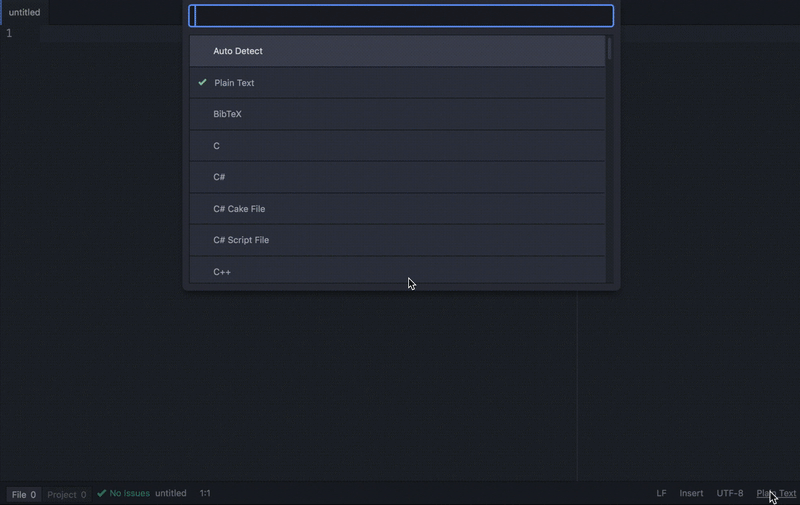

# stackFetch

*Shazam your code into your text editor in real time with this package for Atom!*  Type a word and highlight, then activate stackFetch to find and import code snippets from stack overflow on command. No need to specify language, stackFetch detects it automatically and searches only in that language.  
  
<p align="center"> 

</p>
  
Under the hood, we are making two http requests asynchronously using apm dependency modules, **Google** and NPM **Request**, together with promises. We search Google for _Stack Overflow_-specific content related to your highlighted search term, choose the number #1 result on Google, and import code snippets from the accepted answer on that page. 

## Getting Started
These instructions will get you a copy of the project up and running on your local machine for development and testing purposes. See deployment for notes on how to deploy the project on a live system.

### Prerequisites
```
atom 1.24.0
apm  1.18.12
```
### Installing
From the command terminal, clone the repository to your local directory...
```
$ git clone https://www.gihub.com/izzydoesit/stackFetch.git
$ cd stackFetch
$ atom .
```
# Built With
```
JavaScript 
Atom Text Editor
```
# Authors
Israel Matos - [Github](https://github.com/izzydoesit)

# License
This project is licensed under the MIT License - see the LICENSE.md file for details

# Acknowledgments
The Github and StackOverflow communities. Thanks for all your endless help!  
  
 
